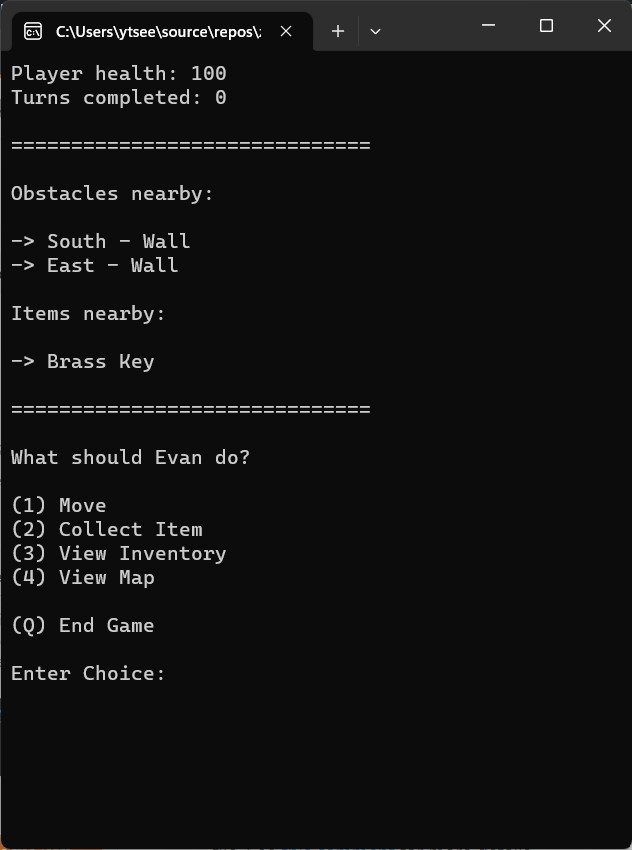

# Evan's Adventure
A bare-bones, roguelike, survival text adventure game built in C++.

Development goals:
* 0 warnings + 0 errors
* no third-party libraries

A pen and paper for taking notes is highly recommended when playing this game.

<b>Trello:</b> https://trello.com/b/72r342tv/evans-adventure

 
